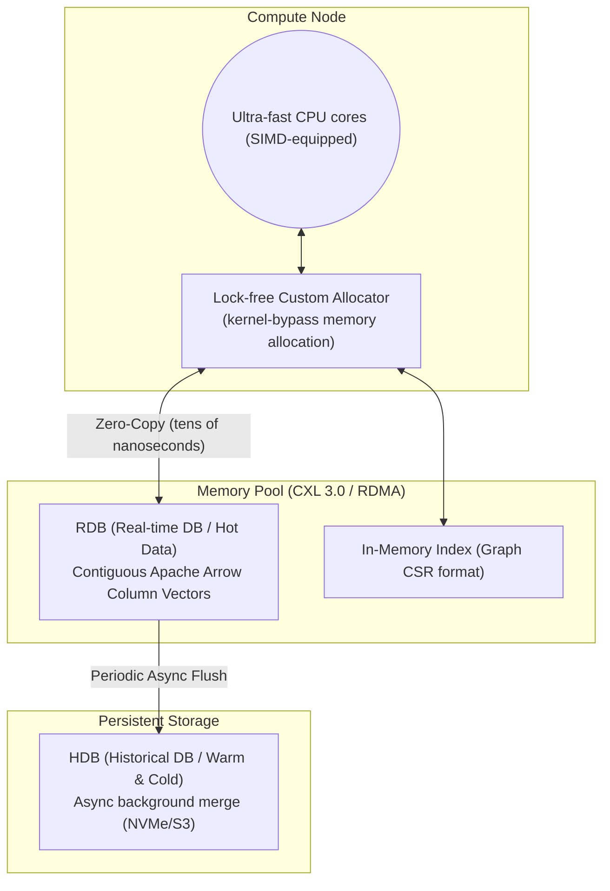

# Layer 1: Storage Engine & Global Shared Memory Pool (DMMT)

This document is the detailed design specification for the **Disaggregated Memory MergeTree (DMMT)** layer, the most critical component of the in-memory DB.

## 1. Architecture Diagram



## 2. Tech Stack
- **Language:** Modern C++20 (utilizing `std::pmr` polymorphic memory resources)
- **Memory technology:** Linux HugePages (minimize TLB misses), RAM Disk (tmpfs), NUMA-aware allocation.
- **Distributed/network memory:** CXL 3.0, **UCX (Unified Communication X)** abstraction layer (auto-switching from on-premises RoCE v2/InfiniBand to AWS EFA and Azure InfiniBand without hardware dependency).
- **Data format:** Apache Arrow data specification (C Data Interface compatible).

## 3. Layer Requirements
1. **OS Independence (Kernel Bypass):** Must not call OS `Syscall` (e.g., `read`, `write`, `mmap`) for data storage and retrieval; must directly manage custom memory regions at the application level.
2. **Columnar Continuity Guarantee:** Collected tick data must be contiguously allocated in pure array units perfectly aligned to cache-line size, preventing pointer-chasing latency.
3. **Non-Stop Background Merge (MergeTree):** Continuously monitor memory saturation and, upon reaching the threshold, asynchronously export compressed historical data to NVMe storage (HDB) without locking.

## 4. Detailed Design
- **Memory Arena technique:** The RDB pre-allocates a large memory space (Pool) via CXL/RDMA (Arena). Rather than dynamically allocating memory (`malloc`/`new`) for each incoming tick, the arena's empty pointer is atomically updated (bump pointer), making allocation cost zero.
- **Partitioning:** Data is divided into partition chunks by `Symbol` and `Hour`. Each chunk becomes a target for HDB flush when it transitions to read-only state.

## 5. Partition Attribute Hints (kdb+ `s#`/`g#`/`p#` equivalent)

APEX-DB supports per-column attribute hints that allow the query executor to use index structures instead of linear scans.

### 5.1 `s#` — Sorted Attribute

**Status:** ✅ Implemented (2026-03-23)

Marks a column as monotonically non-decreasing (append-only guarantee). Enables O(log n) binary search instead of O(n) linear scan for range predicates.

**API:**
```cpp
Partition* part = ...;
part->set_sorted("price");               // mark as sorted
bool ok = part->is_sorted("price");      // query attribute

auto [begin, end] = part->sorted_range("price", 15000, 16000);
// begin/end are row indices [begin, end) satisfying 15000 <= price <= 16000
```

**Implementation:** `include/apex/storage/partition_manager.h`
- `sorted_columns_` (`unordered_set<string>`) stored per partition
- `sorted_range()` uses `std::lower_bound` / `std::upper_bound` on the column span

**Executor Integration:** `src/sql/executor.cpp` — `extract_sorted_col_range()`
- Scans WHERE clause for BETWEEN / `>=` / `>` / `<=` / `<` / `=` on sorted columns
- Fires in `exec_simple_select` (SELECT without aggregation)
- Falls through to `eval_where_ranged(stmt, *part, r_begin, r_end)` — only scans the pruned range

**SQL example:**
```sql
-- With s# on price column: O(log n) binary search, not O(n) full scan
SELECT price, volume FROM trades
WHERE price BETWEEN 15000 AND 16000;
```

**Benchmark:** For 1M rows, a 1% selectivity range filter reduces rows_scanned from 1,000,000 → ~10,000.

### 5.2 `g#` — Grouped (Hash) Attribute

**Status:** Planned

Hash index for low-cardinality columns (e.g., exchange_id, side). O(1) equality lookup.

### 5.3 `p#` — Parted Attribute

**Status:** Planned

Similar to `g#` but with contiguous memory layout per group — enables range skip on a partitioned column.

## 6. Time Range Index

**Status:** ✅ Implemented

Timestamps within each partition are monotonically increasing (append-only). The executor uses `timestamp_range(lo, hi)` (O(log n) binary search) and `overlaps_time_range(lo, hi)` (O(1) partition skip) automatically for `WHERE timestamp BETWEEN ...` clauses.

Related code: `Partition::timestamp_range()`, `Partition::overlaps_time_range()`, `QueryExecutor::extract_time_range()`

## 7. Data Durability — Intra-day Snapshot & Recovery

**Status:** ✅ Implemented (2026-03-23)

### Problem

APEX-DB is an in-memory database. Without explicit persistence:
- A process crash or node restart loses all RDB (ACTIVE partition) data since the last EOD flush.
- SEALED partitions are only written to HDB by `FlushManager` on memory pressure — not on a time-based schedule.

### Design

Two orthogonal mechanisms together close the data loss window to at most `snapshot_interval_ms` (default 60 s):

#### 7.1 Intra-day Auto-Snapshot

`FlushManager` (background thread) writes a **binary snapshot** of every partition — including ACTIVE partitions that have not yet been sealed — to a configurable `snapshot_path` directory.

```
{snapshot_path}/{symbol_id}/{hour_epoch}/{col}.bin
```

The snapshot uses the same LZ4-compressed binary format as HDB flush (`HDBWriter::snapshot_partition()`), but skips the sealed-state check. Files are overwritten on every snapshot cycle, making recovery deterministic.

**Config:**
```cpp
FlushConfig cfg;
cfg.enable_auto_snapshot  = true;
cfg.snapshot_interval_ms  = 60'000;   // 60s default
cfg.snapshot_path         = "/var/apex/snap";
```

**Manual trigger:**
```cpp
flush_manager->snapshot_now();  // synchronous
```

**Implementation:** `src/storage/flush_manager.cpp` — `do_snapshot()`, `snapshot_now()`

Timer check is inside `flush_loop()`:
```
every check_interval_ms:
  → do_flush_sealed()          // existing SEALED flush
  → if now - last_snapshot ≥ snapshot_interval_ms → do_snapshot()
```

#### 7.2 Recovery on Restart

When `PipelineConfig::enable_recovery = true`, `ApexPipeline::start()` reloads the snapshot directory **before** starting drain threads. Recovery is safe at all `StorageMode` levels (PURE_IN_MEMORY, TIERED, PURE_ON_DISK).

```cpp
PipelineConfig cfg;
cfg.enable_recovery          = true;
cfg.recovery_snapshot_path   = "/var/apex/snap";

ApexPipeline pipeline(cfg);
pipeline.start();  // reads snapshot → store_tick() each row → starts drain
```

Recovery path:
1. `std::filesystem::directory_iterator` enumerates `{snap}/{symbol}/{hour}` directories.
2. `HDBReader::read_column()` mmap-reads `timestamp`, `price`, `volume`, `msg_type`.
3. Each row reconstructed as `TickMessage` and replayed via `store_tick()`.
4. Drain threads start after all rows are loaded — no concurrency hazard.

**Implementation:** `src/core/pipeline.cpp` — `ApexPipeline::start()` recovery block

### Guarantees

| Property | Value |
|----------|-------|
| Max data loss window | ≤ `snapshot_interval_ms` (default 60 s) |
| Snapshot overhead | Negligible — sequential write, same thread as flush_loop |
| Recovery time | Proportional to snapshot size (mmap → store_tick) |
| Thread safety | Recovery runs single-threaded before drain threads start |
| Storage format | Same binary `.bin` as HDB — no additional format |

### Integration Test Coverage

| Test | What is verified |
|------|-----------------|
| `HDBTest.AutoSnapshot_CreatesFiles` | `snapshot_now()` creates `price.bin` in snapshot dir for ACTIVE partition |
| `HDBTest.Recovery_ReloadsData` | New pipeline with `enable_recovery=true` restores all 50 rows from snapshot |

---

*Last updated: 2026-03-23*
