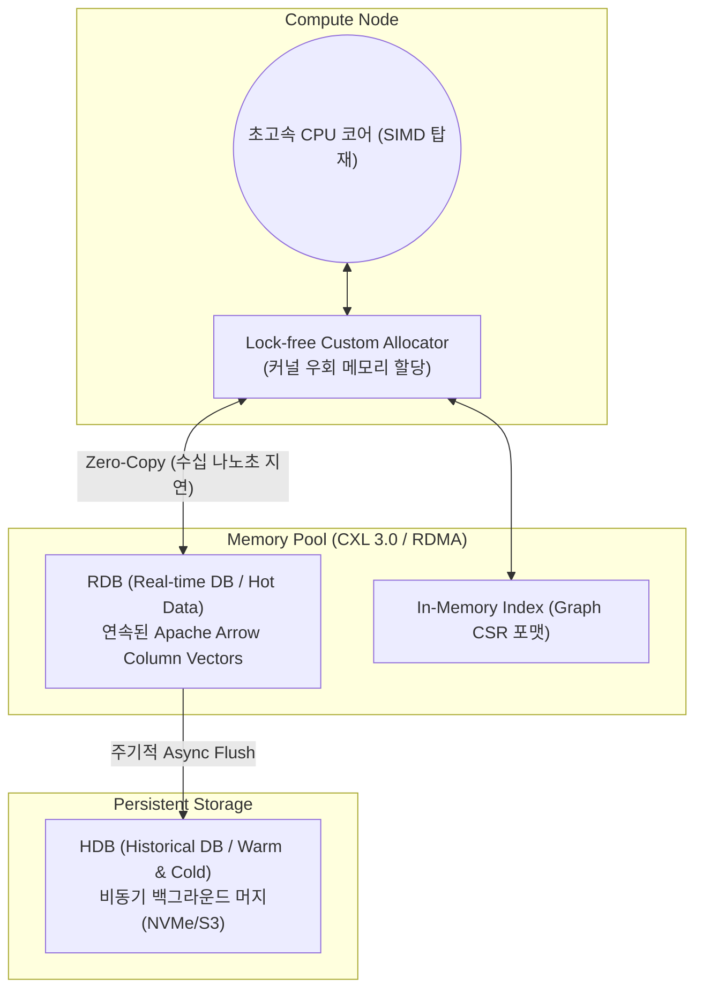

# Layer 1: Storage Engine & Global Shared Memory Pool (DMMT)

본 문서는 인메모리 DB의 가장 핵심인 **Disaggregated Memory MergeTree (DMMT)** 계층의 상세 설계서입니다.

## 1. 아키텍처 다이어그램 (Architecture Diagram)

## 2. 사용될 기술 스택 (Tech Stack)
- **언어:** 최신 C++20 (`std::pmr` 다형성 메모리 자원 활용)
- **메모리 기술:** Linux HugePages (TLB Miss 최소화), RAM Disk(tmpfs), NUMA-aware Allocation.
- **분산/네트워크 메모리:** CXL 3.0, **UCX (Unified Communication X)** 추상화 레이어 적용 (온프레미스 RoCE v2/InfiniBand 부터 AWS EFA, Azure Infiniband까지 하드웨어 종속 없이 자동 스위칭).
- **데이터 포맷:** Apache Arrow 데이터 규격 (C Data Interface 호환).

## 3. 핵심 요구사항 (Layer Requirements)
1. **OS 독립성 (Kernel Bypass):** 데이터 저장 및 조회를 위해 OS의 `Syscall` (예: `read`, `write`, `mmap`)을 호출해선 안 되며, 애플리케이션 레벨의 커스텀 메모리 영역을 직접 관리해야 함.
2. **Columnar 연속성 보장:** 수집된 틱 데이터가 캐시 라인(Cache-line) 크기에 완벽히 정렬된 순수 배열(Array) 단위로 연속 할당되어 포인터 체이싱 지연을 방지.
3. **무중단 백그라운드 병합 (MergeTree):** 메모리 포화도를 지속 모니터링하여 임계치 도달 시, 잠금(Lock) 없이 과거 데이터를 압축하여 NVMe 장비(HDB)로 비동기로 내보냄.

## 4. 구체적 설계 (Detailed Design)
- **메모리 아레나(Arena) 기법:** RDB는 미리 거대한 메모리 공간(Pool)을 CXL/RDMA를 통해 할당받아 둡니다(Arena). 틱이 들어올 때마다 메모리를 새로 동적 할당(`malloc`/`new`)하는 것이 아니라, 아레나 내의 빈 포인터를 원자적(Atomic)으로 갱신(Bump pointer)하여 할당 비용을 Zero로 만듭니다.
- **파티셔닝(Partitioning):** 데이터는 `Symbol별`, `시간별(Hour)` 단위로 파티션 청크(Chunk)로 나뉩니다. 각 청크는 읽기 전용(Read-Only) 상태가 되면 HDB Flush 대상이 됩니다.
