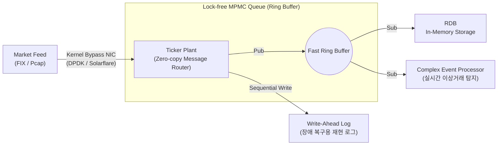

# Layer 2: Ingestion & Network Layer (Tick Plant)

본 문서는 외부 거래소(Exchange)의 네트워크 패킷이 DB 시스템으로 유입되어 분배되는 **초저지연 라우팅 척추망(Tick Plant)** 계층의 상세 설계서입니다.

## 1. 아키텍처 다이어그램 (Architecture Diagram)

## 2. 사용될 기술 스택 (Tech Stack)
- **네트워킹 패킷 처리:** DPDK, **UCX (Unified Communication X)** 프레임워크 (클라우드 벤더 종속 없이 RoCE v2, InfiniBand, AWS SRD를 통합 지원하는 오픈소스 통신 규격).
- **큐 및 락 관리:** C++20 Atomics (`std::memory_order_relaxed`), Rust (패킷 파싱의 메모리 안정성 확보용).
- **라우팅 알고리즘:** 다중 생산자-다중 소비자(MPMC) Ring Buffer, Disruptor 아키텍처 기반 이벤트 루프.

## 3. 핵심 요구사항 (Layer Requirements)
1. **Network OS 스택 우회:** 리눅스 TCP/IP 스택을 버리고, 네트워크 카드(NIC)에서 곧바로 소프트웨어 유저 공간(User Space) 버퍼로 데이터를 폴링(Polling) 방식으로 가져와 인터럽트(Interrupt) 지연시간 제거.
2. **다중 구독 브로드캐스팅:** 단 한 번의 패킷 수신으로, 데이터 저장(RDB), 로깅(WAL), 패턴 분석(CEP) 모듈 등 여러 구독자에게 무복사(Zero-copy) 방식으로 데이터를 쏴주어야 함.
3. **순서 보장(Ordering):** 모든 금융 틱(Tick)은 수신된 마이크로초 단위의 엄격한 선입선출(FIFO) 순번과 글로벌 타임스탬프 스탬핑을 보장해야 함.

## 4. 구체적 설계 (Detailed Design)
- **Ring Buffer 기반 Lock-Free Queue 설계:** 생산자 스레드(Ticker Plant 수신부)는 Ring 버퍼상에 다음 쓸 위치를 Atomic Fetch-and-Add 방식을 통해 선점합니다. 이때 Thread Context-switch나 Mutex Lock을 원천 차단하기 위해 스레드를 한 CPU 코어에 온전히 고정(CPU Pinning)하고 스핀락(Spinlock) 또는 무한 폴링 루프를 돕니다.
- **저장과 파싱의 비동기 분리:** 데이터가 들어오면, Ticker Plant는 가장 원시적인 형태 단위로 WAL에 바로 기록하여 영구성을 확보합니다. 그 직후 RDB 큐로 던져 비동기적으로 컬럼 형식 규격화 및 포맷 배정을 수행합니다.
