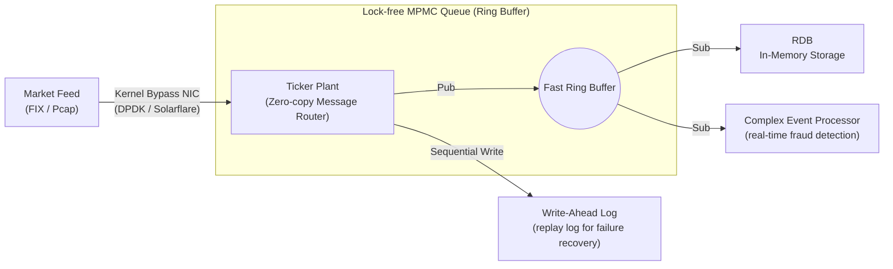

# Layer 2: Ingestion & Network Layer (Tick Plant)

This document is the detailed design specification for the **ultra-low latency routing backbone (Tick Plant)** layer, where network packets from external exchanges are received and distributed to the DB system.

## 1. Architecture Diagram



## 2. Tech Stack
- **Network packet processing:** DPDK, **UCX (Unified Communication X)** framework (open-source communication standard supporting RoCE v2, InfiniBand, AWS SRD without cloud vendor lock-in).
- **Queue and lock management:** C++20 Atomics (`std::memory_order_relaxed`), Rust (for memory safety in packet parsing).
- **Routing algorithm:** Multi-Producer Multi-Consumer (MPMC) Ring Buffer, Disruptor architecture-based event loop.

## 3. Layer Requirements
1. **Network OS Stack Bypass:** Discard the Linux TCP/IP stack and fetch data from the NIC (Network Interface Card) directly to software user-space buffers via polling, eliminating interrupt latency.
2. **Multi-Subscriber Broadcasting:** With a single packet reception, push data to multiple subscribers — storage (RDB), logging (WAL), pattern analysis (CEP) — in a zero-copy manner.
3. **Ordering Guarantee:** Every financial tick must be guaranteed strict microsecond-precision FIFO ordering and global timestamp stamping upon receipt.

## 4. Detailed Design
- **Ring Buffer-based Lock-Free Queue design:** Producer threads (Ticker Plant receive side) pre-claim the next write position on the Ring buffer via Atomic Fetch-and-Add. To fundamentally block Thread Context-switch and Mutex Lock, threads are fully pinned to a single CPU core (CPU Pinning) with spinlock or infinite polling loop.
- **Async separation of storage and parsing:** When data arrives, the Ticker Plant immediately writes to WAL in the most primitive form to ensure durability. It then immediately throws it into the RDB queue for async columnar format normalization and format assignment.

## 5. Apache Kafka Consumer

**Status:** Implemented (2026-03-23) — `include/apex/feeds/kafka_consumer.h`, `src/feeds/kafka_consumer.cpp`

### Purpose

Connects enterprise Kafka data pipelines to APEX-DB ingestion. Kafka is the dominant message bus in fintech, adtech, and e-commerce real-time systems. This integration allows any Kafka producer (market data feeds, event buses, IoT gateways) to stream ticks directly into APEX-DB without an intermediate adapter.

### Architecture

```
Kafka Topic (librdkafka poll)
        ↓
KafkaConsumer::on_message(data, len)
        ↓
decode_json / decode_binary / decode_json_human
        ↓
ingest_decoded(TickMessage)
        ↓
  ┌─ router_ set?  ──→  PartitionRouter::route(symbol_id)
  │                        ├─ local  → ApexPipeline::ingest_tick()
  │                        └─ remote → TcpRpcClient::ingest_tick()
  └─ no router     ──→  ApexPipeline::ingest_tick()  (single-node)
```

### Wire Formats

| Format | Description | Use case |
|--------|-------------|----------|
| `JSON` | `{"symbol_id":1,"price":15000,"volume":100,"ts":...}` | Dev / testing |
| `BINARY` | Raw `TickMessage` bytes (64 bytes, little-endian) | HFT production path |
| `JSON_HUMAN` | `{"symbol":"AAPL","price":150.25,"volume":100}` | General data engineering |

### Routing

- **Single-node:** `set_pipeline(pipeline*)` — all ticks dispatched locally.
- **Multi-node:** `set_routing(local_id, router, remotes)` — uses the same `PartitionRouter` consistent-hash ring as the TCP RPC cluster. Remote ticks forwarded via existing `TcpRpcClient::ingest_tick()`.

### Compile-time Toggle

```cmake
# Enable (requires librdkafka-devel)
cmake -DAPEX_USE_KAFKA=ON ..

# Disabled (default) — decode/routing logic still compiled, start() returns false
cmake -DAPEX_USE_KAFKA=OFF ..
```

Install dependency: `sudo dnf install -y librdkafka-devel`

### Key Classes

| Symbol | File |
|--------|------|
| `apex::feeds::KafkaConfig` | `include/apex/feeds/kafka_consumer.h` |
| `apex::feeds::KafkaConsumer` | `include/apex/feeds/kafka_consumer.h` |
| `apex::feeds::KafkaStats` | `include/apex/feeds/kafka_consumer.h` |

### Prometheus Metrics Exposure

`KafkaStats` is exposed to Prometheus via two cooperating APIs:

```cpp
// 1. Format KafkaStats as Prometheus/OpenMetrics text
std::string metrics_text =
    apex::feeds::KafkaConsumer::format_prometheus("market-data", consumer.stats());
// → apex_kafka_messages_consumed_total{consumer="market-data"} 1234
//   apex_kafka_bytes_consumed_total{consumer="market-data"} 79016
//   apex_kafka_decode_errors_total{consumer="market-data"} 0
//   apex_kafka_route_local_total{consumer="market-data"} 1000
//   apex_kafka_route_remote_total{consumer="market-data"} 234
//   apex_kafka_ingest_failures_total{consumer="market-data"} 0

// 2. Register with HttpServer to extend GET /metrics
server.add_metrics_provider([&consumer]() {
    return apex::feeds::KafkaConsumer::format_prometheus("market-data", consumer.stats());
});
// Multiple consumers: call add_metrics_provider() once per consumer with distinct names.
```

`HttpServer::add_metrics_provider()` is a generic extension point — it accepts any `std::function<std::string()>` and appends its output to the existing pipeline stats in `/metrics`. There is no compile-time dependency between `apex_server` and `apex_kafka`.

**Metric names and types:**

| Metric | Type | Description |
|--------|------|-------------|
| `apex_kafka_messages_consumed_total` | counter | Messages successfully decoded and dispatched |
| `apex_kafka_bytes_consumed_total` | counter | Total payload bytes received |
| `apex_kafka_decode_errors_total` | counter | Messages that failed to decode |
| `apex_kafka_route_local_total` | counter | Ticks sent to local pipeline |
| `apex_kafka_route_remote_total` | counter | Ticks forwarded via RPC |
| `apex_kafka_ingest_failures_total` | counter | Drops after all backpressure retries |

### Tests

26 unit tests in `tests/unit/test_kafka.cpp` — all pass without a live Kafka broker:
- Config defaults
- `decode_json` (basic, ts-optional, missing fields, invalid, null)
- `decode_binary` (exact, too-short, null)
- `decode_json_human` (known symbol, unknown symbol, missing price)
- `ingest_decoded` (no pipeline, single-node)
- `on_message` stats tracking (valid message, decode error)
- `format_prometheus` (counters, HELP/TYPE lines, zero stats, label values)
- `start()` graceful return when library not compiled in

4 integration tests in `tests/unit/test_features.cpp` (`MetricsProviderTest`):
- `DefaultMetricsContainApexCounters` — baseline /metrics output
- `RegisteredProviderAppearsInOutput` — custom provider text in /metrics
- `MultipleProvidersAllAppear` — two providers both present
- `KafkaStatsProviderIntegration` — live KafkaConsumer stats via format_prometheus

### Redpanda / WarpStream Compatibility

`KafkaConsumer` uses the standard Kafka consumer API (group ID, `subscribe()`, `consume()`). Any Kafka-API-compatible broker (Redpanda, WarpStream, MSK) works without code changes.

Last updated: 2026-03-23 (Kafka Prometheus metrics exposure added)
