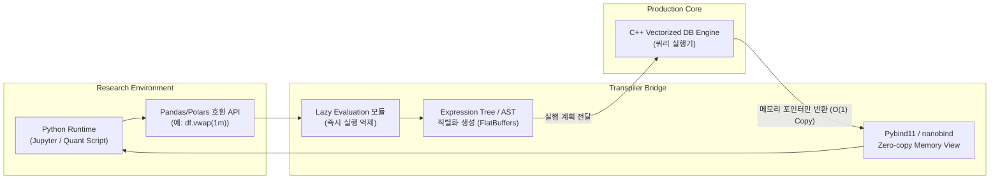

# Layer 4: Transpilation Layer (Research to Production Bridge)

본 문서는 파이썬(Research) 기반의 퀀트 코드를 무손실, 초저지연으로 C++ 실행 엔진(Production)에 연결해주는 핵심 **클라이언트 및 브릿지 레이어**의 상세 설계서입니다.

## 1. 아키텍처 다이어그램 (Architecture Diagram)

## 2. 사용될 기술 스택 (Tech Stack)
- **파이썬 C++ 바인딩:** `nanobind` (최신 경량 대안, Pybind11 대비 빌드 속도 및 용량 절약), CPython API.
- **데이터 교환 포맷:** Apache Arrow C-Data Interface, FlatBuffers (초경량 직렬화 트리 구성용).
- **파이썬 라이브러리:** `ast` 모듈, Pandas/Numpy C-API 호환 모듈.

## 3. 핵심 요구사항 (Layer Requirements)
1. **Lazy Evaluation 기법 필수:** 사용자의 Python 백테스트 로직은 절현대 즉시 C++에서 루프가 돌지 않습니다. 최종적으로 연산 결과가 필요할 때(예: `.collect()`, `.show()`) 비로소 모아진 여러 조건을 하나의 큰 쿼리 트리로 던져야 최적화 효과를 노릴 수 있습니다.
2. **Serialization (직렬화/역직렬화) Zero 패러다임:** 엔진(C++)의 조회가 끝났을 때 나오는 메모리 결과 값은 `Python List`나 `dict`로 감싸 파싱해선 절대 안 됩니다. 엔진 스토리지(Layer 1 - RDB)의 Apache Arrow DataBuffer 생 포인터를 Numpy/Pandas의 MemoryView로 주입해야 단 1ns도 손실이 일어나지 않습니다.

## 4. 구체적 설계 (Detailed Design)
- **DSL (Domain Specific Language) 오버로딩:** 파이썬 측 클라이언트 라이브러리에 DataFrame 클래스를 설계하고 모든 Magic 메서드 (`__add__`, `__gt__`, `__getitem__` 등)를 오버로딩합니다. 예를 들어 `df['price'] > 100`가 호출되면 내부적으로 bool을 연산하는 게 아니라, `'GreaterThan(Column("price"), Constant(100))'` 형태의 노드 객체를 모아 연결 리스트에 끼워 넣습니다.
- **Apache Arrow C-Data 활용 연동:** C++ 엔진이 처리를 마치고 결과를 반환할 때, ABI 수준의 호환 구조체인 `ArrowArray` 와 `ArrowSchema`의 메모리 주소를 Python 바인딩 쪽으로 패스합니다. Python 쪽은 Numpy를 초기화할 때 버퍼 위치를 받아올 수 있는 파라미터를 사용해 단숨에 Pandas DataFrame으로 외형만 뒤바꿉니다. 백테스트 데이터를 1억 건 불러와도 처리 시간이 1ms 이하를 보장합니다.
